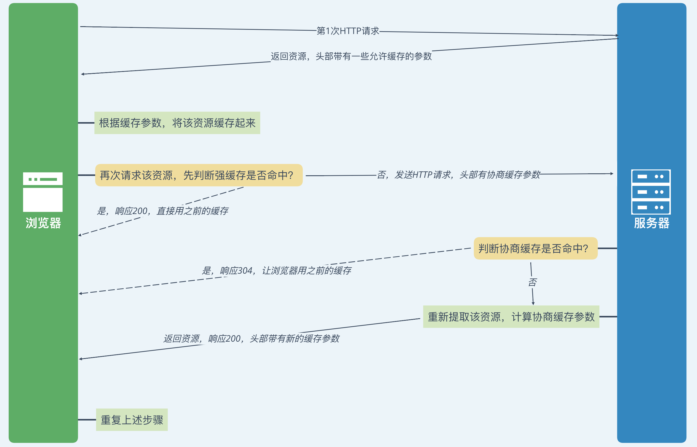
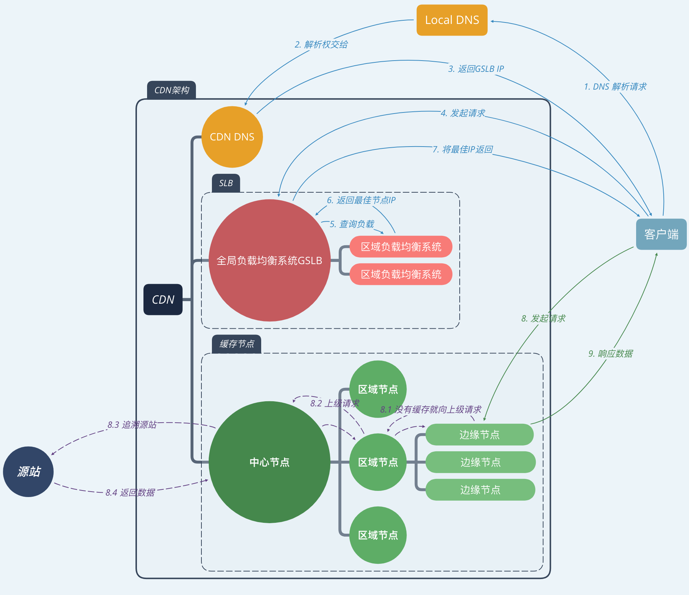
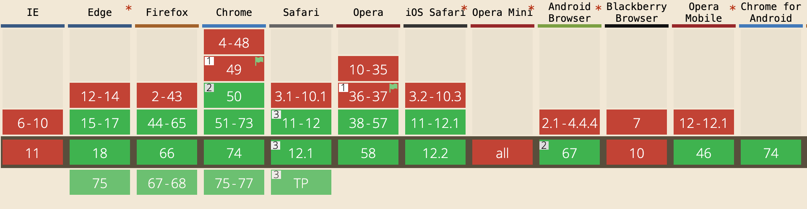

[TOC]

# 引子

前端早已度过了刀耕火种的年代，而进入了模块化、工程化的协同工作时代。

在一个成规模的前端项目中，如何在开发、测试完成后进行代码的上线部署、如何平稳得进行迭代更新、以及如何最大限度得利用缓存，都是一个合格的前端项目需要认真考虑的问题。

这些问题的解决不仅促进了前端项目工程化、自动化，同样对性能也是种优化。


# HTTP缓存

让我们从一个最简单的页面开始举例：

我们现在有一个页面：`index.html`，引用了一个样式表：`a.css`。

```html
<html>
  <head>
    <link href="a.css" />
  </head>
  <body></body>
</html>
```

在我们开发测试完毕之后，我们到达了上线步骤，我们将这些文件放入服务器。这时候我们来访问这个页面的话，是这样的效果：

| Name       | Type       | Status | Size  | Time  |
| ---------- | ---------- | ------ | ----- | ----- |
| index.html | document   | 200    | 115KB | 138ms |
| a.css      | stylesheet | 200    | 9.5KB | 392ms |

一切看起来没有问题，响应都是200，页面正常展示。


但这时我们觉得这个页面短时间内不会更改的话，如果访问量特别多，带宽会被严重浪费。这时候我们想到了`HTTP缓存`：**强缓存**（`Expires`、`Cache-Control`等头）和**协商缓存**（`ETag`等）。



如果利用这些缓存，那么在这个页面没有更改的这段时间内来访问，将会让浏览器直接使用文件副本，避免了HTTP文件传输，对带宽消耗是个很大的优化。


# 消灭304

对于这两种缓存，我们发现对于这些静态资源来说（如`a.css`），如果让浏览器使用**协商缓存**（即响应304），但是此过程依然要发送HTTP请求和接收响应，这依然会浪费带宽：

| Name       | Type       | Status | Size  | Time  |
| ---------- | ---------- | ------ | ----- | ----- |
| index.html | document   | 304    | 115KB | 32ms  |
| a.css      | stylesheet | 304    | 9.5KB | 102ms |

因此便有了一个计划：**消灭304**，也就是尽量利用**强缓存**，让浏览器无需发送HTTP请求，直接从本地读取缓存。


我们以`Cache-Control`头举例：

也就是在`a.css`文件内容没有改变时，让文件的响应头的`Cache-Control`的`max-age`等于这个文件的过期时间。那么浏览器在此过期时间以内，将会直接使用本地副本：

| Name       | Type       | Status | Size              | Time |
| ---------- | ---------- | ------ | ----------------- | ---- |
| index.html | document   | 304    | 115KB             | 32ms |
| a.css      | stylesheet | 200    | (from disk cache) | 2ms  |

这无疑会大大降低带宽消耗。


# 使用CDN

即使使用了HTTP缓存头来控制缓存，也只是提升了二次访问的速度。对于首次访问的加速，我们需要从网络层面进行优化。

最常见的手段就是CDN（Content Delivery Network，内容分发网络）加速。通过将静态资源缓存到离用户很近的相同网络运营商的CDN节点上，不但能提升用户的访问速度，还能节省服务器的带宽消耗，降低负载。

CDN节点能缓存静态资源，用户请求会被智能DNS系统自动解析到最近的节点。

CDN部署一般来讲有以下两点：

1. 将静态资源尽可能部署到不同地区、不同运营商网络线路的服务器中；
2. 静态资源地址应使用CDN域名而不与页面域名相同，一方面方便CDN的智能DNS解析服务，另一方面发向静态资源的请求不会带上页面的cookie等数据，减少网络传输量。


架构图（只是一种）如下：




# 更新

做了上述的一些步骤后，看起来似乎已经很好了。但是**强缓存**会让浏览器连发送HTTP请求的机会都没有。

如果这个页面永远也不变（肯定不可能呀🤷‍♂️）的话还好，但当我们需要更新页面的时候，浏览器怎么能知道我们更新了呢？这又带来了新的问题，甚至是一个很大的挑战。


## query

一般前端团队首先想到的肯定是，对静态资源的请求加上带版本号的`query`，比如：

```html
<link href="a.css?v=1.0.0" />
```

或

```html
<link href="a.css?t=20190515" />
```

这非常直观，因为这样的话能够明确看到希望浏览器获取更新的版本，浏览器将会不使用本地缓存而是开始发送HTTP请求。

一经测试发现效果还不错，但是我们再考虑一个情况，这个`index.html`引用了好几个静态资源：

```html
<link href="a.css?v=1.0.0" />
<link href="b.css?v=1.0.0" />
<script src="a.js?v=1.0.0"></script>
```

如果我们某次只改动了一个文件比如`a.css`，版本变成了`v=1.0.1`，但由于构建的时候把文件内的引用全部替换成了新的版本号，那无疑对带宽依然是种浪费：一个文件的改动导致其他所有静态资源无法使用缓存。

这种方式部署，也容易带来CDN缓存攻击问题：

> 对于这样一个引用：
>
> ```html
> <script src="a.js?v=1.0.0"></script>
> ```
>
> 我们不难预测，a.js 的下一个版本是“ 1.0.1 ”，那么就可以刻意构造一串这样的请求“ a.js?v=1.0.1 ”、“ a.js?v=1.0.2 ”、……让 CDN 将当前的资源缓存为“未来的版本”。
>
> 这样当这个页面所用的资源有更新时，即使更改了链接地址，也会因为 CDN 的原因返回给用户旧版本的静态资源，从而造成页面错误。


针对这种问题，我们意识到，让文件的版本号同**文件内容本身**关联起来，不就好了吗？那用什么来标示文件是否改变呢，很容易想到：**摘要算法**：

```html
<link href="a.css?v=1d33s3" />
<link href="b.css?v=def23e" />
<script src="a.js?v=73dse9"></script>
```

这样在构建的时候，先对文件进行hash计算得出摘要，并以此特征值作为文件的版本号；如果文件内容未改变，那么它的版本号同上次一样。这样不就能针对单个文件进行缓存的更新了吗？

似乎已经优化很多了，然而。。。


## 发布顺序

发布的时候，面对一大堆文件，总会有个发布的先后顺序。既然有先后，就有时间间隔，那么问题又来了😭。

对于主资源`HTML`和静态资源`css、js、img`等，发布顺序有这样两种情况：

1. **先上html，再上静态资源。**

在这个间隔期，如果有用户访问页面，页面是新的，资源是旧的，页面出错❌；而且这个出错很有可能持续下去，直到对资源的缓存过期，除非手动刷新。

2. **先上静态资源，再上html。**

在这个间隔期，如果有用户访问页面，并恰巧该用户浏览器未缓存旧资源，那么页面是旧的，资源是新的，页面出错❌；直到html部署完成之后，再去访问页面恢复正常。


结果就是：无论怎么发，都会出错。

所以有些前端团队认为第二种方式相对可接受，并且选择在半夜上线，寄希望于这时极少用户访问，报错减少，但这样是**掩耳盗铃**，根本没有解决问题。


## 非覆盖式发布

以上问题的原因：部署方式全部是**覆盖式发布**，文件名未改变只是内容改变。那么解决方案就来了：**非覆盖式发布**，即内容改变时，将文件名也改变。

> 当然是指利用摘要算法：**基于文件内容的hash版本冗余机制**。只改变内容变化的文件。如果还使用版本号的格式，依然会有一个文件更改影响所有文件缓存的问题，而且每次上线会将所有静态资源的数量翻倍。

更改前：

```html
<link href="a-2edfe3.css" />
```

更改后：

```html
<link href="a-3e33ef.css" />
```

于是在上线时，先部署静态资源，再灰度部署页面。这时已经部署新页面的地方，用户访问新页面能获取到新静态资源；未部署页面的地方，用户访问旧页面也能获取到旧静态资源（因为未覆盖）。

这样做的好处有：

1. 可以先上线静态资源，再上线html，不存在间隙问题；
2. 遇到问题回滚版本的时候，无需回滚静态资源，只须回滚页面即可；
3. 所有静态资源可以开启永久强缓存，缓存利用率大增；


## 递归计算

通过上面这些步骤，这下似乎一切问题都解决了。但是这个过程用人工手动解决总不太优雅，况且静态资源经常嵌套引用，比如在`a.css`：

```css
.class{
  background: url(a.png);
}
```

然后在`index.html`中引用这个css：

```html
<link href="a.css" />
```

那么这种情况下，我们对文件进行摘要标识的时候，应从最里层到最外层这样递归计算：

1. `a.png`修改后 —> `a-8244e91.png`；
2. 在`a.css`中修改引用，再计算`a.css`的md5 —> `a-3eef83.css`；
3. 在`index.html`中修改引用。


这样的步骤，往往需要一个构建工具来进行自动化流程，如`gulp.js`。


# 压缩

当静态资源的发布问题已经解决的差不多的时候，我们还应该将目光投向HTTP传输过程中。

尽管已经最大化利用了强缓存，使页面的静态资源直接从浏览器的副本中读取，从而避免了HTTP传输耗时。但是在项目新版本发布时，总要至少一次HTTP传输以获取新的资源，哪怕是这一次传输，我们也要尽可能地加速这个过程；同时也减小了网络流量消耗，节省了带宽。

自然很容易想到的就是，对传输的内容进行精简，也就是**压缩**。


## 代码压缩

也就是对`css`、`js`等资源进行压缩，这将能直接减小文件体积。

通用的一般有：去掉空格，换行，注释等，因为这些东西只是方便开发人员，而对机器来说无意义。

针对`css`文件，一般**还有**：

- 缩写：对某些可缩写的属性进行合并缩写。

  ```css
  /* 之前的样式 */
  .demo{
    	background-color: #FFF;
  		background-image: url(a.png);
  		background-position: bottom;
  		background-repeat: repeat-x;
    	margin-left: 5px;
  		margin-right: 6px;
  		margin-bottom: 7px;
  		margin-top: 8px;
  }
  
  /* 缩写后的样式 */
  .demo{
    	background: #FFF url(a.png) repeat-x bottom; 
    	margin: 8px 6px 7px 5px; 
  }
  ```

- 公用：对几个css属性大体相同的选择器，进行重写。

  ```css
  /* 之前的样式 */
  .demo1{ font-size:12px;border:1px solid #000000;padding:5px;width: 50px;}
  .demo2{ font-size:12px;border:1px solid #000000;padding:5px;width: 100px;}
  .demo3{ font-size:12px;border:1px solid #000000;padding:5px;width: 150px;}
  
  /* 之后的样式 */
  .demo1, .demo2, .demo3{ font-size:12px;border:1px solid #000000;padding:5px;}
  .demo1{width: 50px;}
  .demo1{width: 100px;}
  .demo1{width: 150px;}
  ```

等等。

针对`js`文件，一般**还有**：

- 混淆：替换变量名或方法名，因为字面意义对机器实际无意义；不仅字符变少，也使代码难以阅读。

  ```javascript
  // 之前
  function add(paramA, paramB){
    	return paramA + paramB + 1;
  }
  
  // 之后
  function add(a,b){return a+b+1}
  ```

- 加密：一般用eval方法加密。（不过js的加密一般都是对称加密，意义不大，反而会增加耗时）

  ```javascript
  // 之前
  function add(paramA, paramB){
    	return paramA + paramB + 1;
  }
  
  // 之后
  eval(function(p,a,c,k,e,r){e=String;if(!''.replace(/^/,String)){while(c--)r[c]=k[c]||c;k=[function(e){return r[e]}];e=function(){return'\\w+'};c=1};while(c--)if(k[c])p=p.replace(new RegExp('\\b'+e(c)+'\\b','g'),k[c]);return p}('3 4(0,2){5 0+2+1}',6,6,'a||b|function|add|return'.split('|'),0,{}))
  ```
  
- 删除某些语句：有些语句只是在测试环境需要，而线上没必要，就将其删去。比如`console`、`alert`等。


## 图片压缩

许多时候我们的图片资源都是设计师直出的，往往我们不多加处理就直接发布上线，实际上我们还可以在发布前提前进行压缩、合并优化，以减小图片体积。

可视图片使用途径，有针对性地进行压缩。

- icon图标，一般较小，可以先降低分辨率（尤其是移动端），然后合并做成一张**雪碧图**（`sprite`）；或者作为`iconfont`——一种特殊字体——来使用。这样会减少HTTP请求。
- 一般图片，利用某种算法进行压缩（有损或无损），有的压缩比例能达到70%以上，却无肉眼差别。


## HTTP传输压缩

在我们将文件通过构建过程进行压缩发布之后，仍然可以在HTTP传输过程中对文件再压缩一次（算法压缩）。

不过这样子的话，虽然节省了带宽流量，但是会额外增加服务器的CPU开销。

> 需要注意的是，对于某些特定类型的文件（比如已经压缩过的图片），再额外压缩反而会增加体积。


常见的一个响应头部：`Content-Encoding`，表示了该响应内容的编码格式，来通知浏览器使用对应方式解码。

对应的一个请求头部：`Accept-Encoding`，表示可接受的编码格式；可以有多个，常见的有：`gzip`、`deflate`、`br`等。


现在的浏览器几乎全部支持了`gzip`，所以`gzip`也是最最常常见的编码格式。


在实践中，有些项目会将前端代码在构建时提前`gzip`压缩好，再进行部署。不过一般都是让`nginx`这样的反向代理服务器进行实时压缩，虽然第一次压缩消耗服务器CPU性能，但之后的请求可以利用缓存。所以，是构建时压缩（指`gzip`这种压缩）还是服务器实时压缩，就具体看业务情况了。


另外，Google在2015年发布了一种叫`Brotli`的无损压缩方式，也就是头部中的`br`。经测试，相比`gzip`压缩率更高、而压缩时间只略长。因此它的压缩优势目前来讲是最大的，只是浏览器的支持度没有`gzip`好，浏览器对`brotli`的[支持度](https://caniuse.com/#search=brotli)如下：




# 总结

| 措施                           | 目的                           |
| ------------------------------ | ------------------------------ |
| 配置长时间的本地缓存           | 节省带宽，加速页面加载         |
| 基于文件内容的hash版本冗余机制 | 精确缓存控制，减少发布错误     |
| CDN部署                        | 优化网络请求，降低源站压力     |
| 非覆盖式发布                   | 平滑升级，方便回退             |
| 压缩                           | 加速传输，节省带宽，防止被窃用 |

