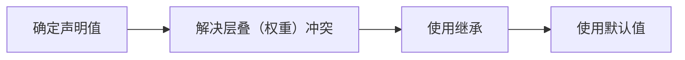

最重要的三个规则：

1. 属性的计算过程
2. 盒模型
3. 视觉格式化模型

## 属性值的计算过程

一个元素的所有 CSS 属性必须计算有值之后，才能渲染。

计算过程：

### 层叠

浏览器如何解决**声明冲突**的过程。

1. 比较**重要性**：从高到低
   1.1 作者样式表的`!important`
   1.2 作者样式表普通样式
   1.3 浏览器默认样式表
2. 比较**特殊性**：看选择器
   2.1 选择器选中的范围越窄，越特殊
   2.2 通过选择器，计算出一个 4 位数
   - 千位：内联样式为 1，否则为 0
   - 百位：id 选择器的数量
   - 十位：类选择器、属性选择器、伪类选择器的数量
   - 个位：所有元素选择器、伪元素选择器的数量
3. 比较**源次序**：代码中书写靠后的优先

## 盒模型

1. 行盒：`display: inline`
2. 块盒：`display: block`，独占一行

`display` 默认为行盒

盒组成部分：

1. `content` 内容，只包含内容的盒叫**内容盒 content-box**
2. `padding` 填充（内边距），包含内容+填充的盒叫**填充盒 padding-box**
3. `border` 边框，包含内容+填充+边框的盒叫**边框盒 border-box**
4. `margin` 外边距

### 宽高

`width` 和 `height` 默认设置的是**内容盒**的宽高。
可使用`box-sizing: border-box`更改盒子为**边框盒**，此时宽高将是边框盒的宽高。

### 背景

`background` 默认覆盖的是**边框盒**的范围。
可使用 `background-clip` 设置背景覆盖的盒。

### 溢出处理

内容溢出**边框盒**时默认是可见的，即 `overflow: visible`。

### 行盒

1. 宽高设置无效
2. 实际宽高根据内容延伸
3. `padding`、`border`、`margin` 只有水平方向有效，垂直方向不占据实际空间。

例外：**可替换元素**，如 `img`、`video`、`audio` 等，他们是行盒，但是类似于行块盒。

> 如果文字不在行盒中，浏览器会自动生成一个**匿名行盒**包裹文字。

### 行块盒

`display: inline-block`，兼有行盒和块盒的特性。

## 视觉格式化模型

### 包含块

就是元素排列的参考坐标的范围。

### 常规流

又叫常规文档流、普通文档流等。
总体规则：**块盒独占一行，行盒水平依次排列**。

常规流下，绝大部分情况下，盒子的包含块，为其**父元素的内容盒**。

水平方向上：
每个块盒的总宽度，必须**刚好等于**包含块的宽度。
如果手动设置了相关样式，导致 width + padding + border + margin 的值依然不满包含块的高度，则包含块的剩余宽度被 margin-right 吸收。

> 常规流中块盒怎么水平居中：
> `margin: 0 auto`，这样左右外边距会共同吸收剩下的包含块的宽度，就会水平居中了。

> 宽度、内外边距的百分比是相对于谁的？
> 相对于自身所在的**包含块的宽度**。

> 常规流中上下两个**相邻的**块盒的 margin 将会合并。取最大值。
> 常规流中父子块盒的 margin 也将合并。（父子元素之间不能有东西，比如父元素有 border，则 margin 不会合并 ）

### 浮动

`float: left/right`，即可以设置元素为浮动。

1. 设置浮动后，元素自动成为块盒。
2. 浮动元素的包含块也是父元素的内容盒（与常规流一样）。
3. 浮动元素的宽度为 auto 时，自适应内容宽度。
4. 浮动元素的 margin 为 auto 时，等于 0，不会自动吸收包含块的剩余宽度。
5. 浮动元素和块盒并列时，块盒会无视浮动元素。（就相当于浮动元素盖在了块盒之上）

> 高度坍塌：
> 根源：常规流块盒的高度默认值是 auto，即自动为内容高度。在计算内容高度时，会无视浮动元素。
> 解决：清除浮动 `clear: left/right/both`。设置此属性的块盒将不会无视在它之前的浮动元素。 常见代码是为父元素增加 after 伪元素，设置为块盒，并设置 `clear: both`。

### 定位

精准控制元素在其包含块中的位置。即改动 `position` 属性，只要不是默认值（`static`），就是被定位的元素。

1. 除相对定位（`relative`）外，将会脱离常规文档流。
   1.1 相对定位只会让元素在原有位置进行偏离。
   1.2 相对定位不会影响其他兄弟元素。
2. 绝对定位（`absolute`），宽高自动为 auto，适应内容。
   2.1 包含块将变成祖先元素中**第一个定位元素的填充盒**。（注意不是内容盒）
   2.2 如果找不到，就相对于整个网页。
3. 固定定位（`fixed`），基本都和决定定位一样，只有包含块不一样，包含块为**视窗范围**

> 利用 margin 使定位元素在某个方向上居中：
> 定宽（高），左右（上下）都设置 0，margin 设置 auto，此时 margin 将会吸收包含块的剩余空间。

绝对定位或固定定位元素，将被**自动设置为块盒**。

堆叠上下文：

1. `z-index` 只对定位元素有效。
2. 通常情况下，值越大，越靠上（越靠近用户）。
3. 如果是负数，则会被常规流和浮动元素覆盖。

### BFC

块级格式化上下文 Block Formatting Context。
它是一块**独立**的渲染区域，规定了在该区域中，**常规流块盒**的布局。BFC 内部的渲染规则不会影响外部。

能在其内部创建 BFC 的区域：

- 根元素
- 浮动和绝对定位
- overflow 不是 visible 的元素
