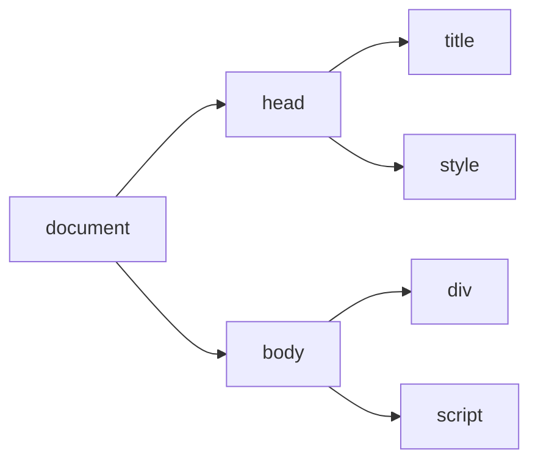
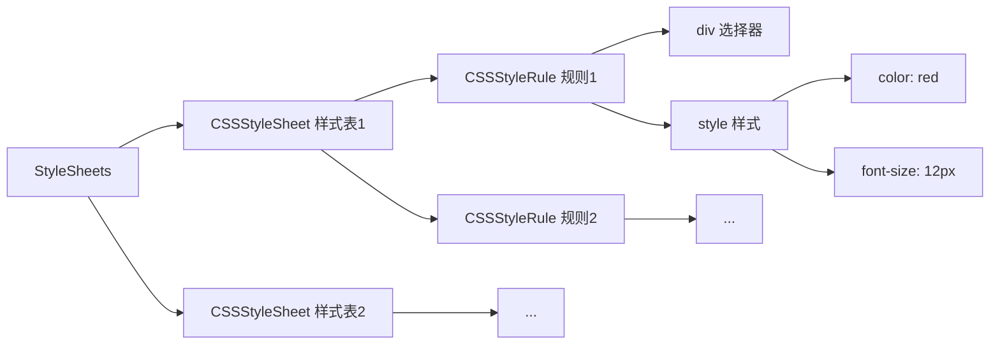
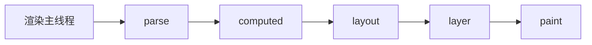
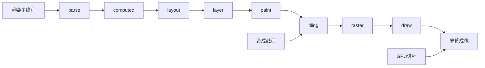

### 渲染时机

当网络线程接收到 HTML 文档后，产生一个**渲染任务**，并将其传递给渲染主线程的消息队列。
在**事件循环**机制的调度下，**渲染主线程**取出该任务，启动渲染任务。

### 渲染流水线

渲染流程分为多个阶段，每个阶段都有明确的输入输出，上一个阶段的输出会成为下一个阶段的输入。

一共分为**八个阶段**：

#### 1. 解析 HTML - parse HTML

从 「HTML 字符串」 到 「DOM tree & CSSOM tree」 的过程，简单说就是解析生成两棵树。

DOM tree:

CSSOM tree:

CSSStyleSheet（样式表）：样式表有「style 标签样式表」、「link 标签样式表」、「内联（行内）样式表」和「浏览器默认样式表」。
样式表下有规则（CSSStyleRule），规则下有**选择器** 和 **样式**。

> 除了浏览器默认样式（user agent stylesheet）以外，其他样式表 JS 都可以操作。
> `document.styleSheets` 获取所有样式表
> `document.styleSheets[0].addRule` 可以向第 0 个样式表内添加样式

**HTML 解析过程中遇到 CSS 或者 JS 代码怎么办？**
总的来说，遇到 CSS 解析 CSS，遇到 JS 执行 JS。

- 为了提高解析效率，在解析之前浏览器会启动一个「**预解析线程**」率先下载和解析外部的 CSS 和 JS 文件。
- 预解析线程发现外部的文件时，启动网络线程进行下载，下载完毕后对结果进行预处理。

对于外部 CSS（也就是 link 标签）：

- 主线程按照顺序解析，如果遇到外部文件还没有下载完，会继续向后解析。
- 这样预解析线程和网络线程就不会阻塞主线程。**这就是 CSS 解析不会阻塞 HTMl 解析的根本原因**。

对于外部 JS：

- 停止解析 HTML，主线程一直等待 JS 文件下载好。
- 下载完毕后，主线程再将此时的全局代码执行完毕，才能继续解析 HTML。
- 这是因为 JS 可能会改变当前 DOM，所以要等待 JS 执行完毕再继续解析。**这就是 JS 会阻塞 HTMl 解析的根本原因**。

#### 2. 样式计算 - Recalculate Style

便利 DOM 和 CSSOM 进行样式计算，生成一颗带有 Computed Style 的 DOM tree。
也就是每个 DOM 元素都会得到自己的 computed 的最终样式。

在这一个过程中，一些预设值会计算成绝对值，比如 `red` 变成 `rgb(255,0,0)`、`em` 变成 `px` 等。

> JS 里如何获取某个元素的最终样式？
> `getComputedStyle(el)`

#### 3. 布局 - Layout

遍历此时的 DOM tree，生成 layout tree。生成元素的几何信息，比如尺寸、位置等。

Layout tree 和 DOM tree 大部分时候是不一一对应的。
因为有些元素会 `display: none` 隐藏、会有 before/after 伪元素、会有匿名块盒、匿名行盒等。

#### 4. 分层 - Layer

主线程会使用一套复杂的策略对整个 layout tree 进行分层。
分层的好处是：将来某一层改变时，将仅会对该层进行处理，提升效率。

> 常见的影响分享的原因：「滚动条」、「堆叠上下文」、「transform」、「opacity」等，或者「will-change」也会更大程度影响浏览器的分层结果。

#### 5. 绘制 - Paint

为每一层生成一些绘制的指令集，用于描述如何绘制。

渲染主线程的工作到此为止，剩余步骤将交给其他线程完成。

#### 6. 分块 - Tiling

此时主线程将绘制信息提交给**合成线程**，将会为每一层分为多个小区域。
然后合成线程会分配多个线程来完成分块工作，生成分块信息。

> 为什么要分块：
> 比如可以优先绘制视窗尺寸范围内的样式信息，提升效率。

#### 7. 光栅化 - Raster

合成线程将分块信息交给 **GPU 进程**，以极高的速度完成光栅化。
GPU 进程也会开启多个线程来完成，优先处理视窗范围附近的块。

光栅化的结果，就是分块后的位图，包含许多像素点的信息。

#### 8. 画 - Draw

合成线程根据位图生成一些 **「指引（quad）」** 信息，指引会标识出每个位图应该画到屏幕的哪个位置，同时考虑有没有变形信息（`transform`）。
合成线程把 quad 提交给 GPU 进程，由 GPU 进程产生系统调用，完成最终成像。

> transform 效率高的本质原因？
> transform 本质就是 matrix 矩阵变换，发生在合成线程，与渲染主线程无关，由 GPU 直接成像。

---

### 完整过程

### 常见问题

#### 什么是 reflow?

当我们修改 DOM tree 或者 CSSOM tree 的时候（比如增加元素、修改元素宽高尺寸、修改元素布局等），将会重新进行 style computed，那么后续的步骤全会重新来一遍，计算样式->布局->分层->...。

浏览器会合并一些连续的 reflow 操作，避免连续多次的反复计算。
所以，这时改动造成的 reflow 是异步完成的。

也同样因此用 JS 获取某个布局属性时，可能无法获取最新的布局信息。所以如果是获取布局属性，将立即 reflow。

#### 什么是 repaint?

如果改动的属性无关尺寸信息的时候（比如背景颜色、字体颜色）等，浏览器将根据分层信息（layout）重新计算绘制指令（paint）。

reflow 一定会导致 repaint，因为 reflow 影响的步骤在 repaint 之前。
